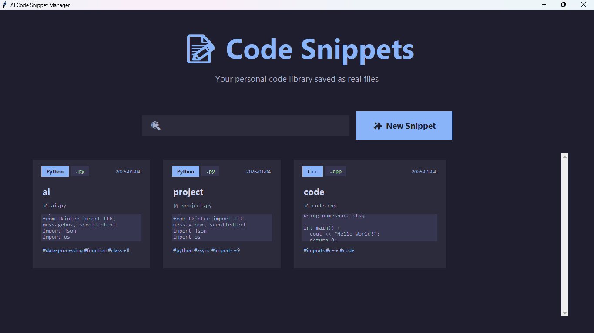

# 🚀 AI Code Snippet Manager


A modern, AI-powered desktop application for managing and organizing your code snippets. Built with Python and Tkinter, featuring a sleek dark-mode interface and intelligent tagging system.



## ✨ Features

### 🎨 Modern User Interface
- **Dark Mode Design** - Professional, eye-friendly interface
- **Card-Based Layout** - Beautiful grid display of your snippets
- **Responsive Design** - Smooth animations and hover effects
- **Real-time Search** - Instant filtering as you type

### 🤖 AI-Powered Tagging
- **Automatic Tag Generation** - AI analyzes your code and creates relevant tags
- **Pattern Recognition** - Detects functions, classes, loops, and programming constructs
- **Smart Keyword Extraction** - Pulls meaningful terms from titles and code
- **Multi-tag Support** - Color-coded tags for different categories

### 📁 File System Organization
- **Real Code Files** - Saves as actual .py, .js, .java, .cpp files
- **Auto-organized Folders** - Separate folder for each programming language
- **Smart Naming** - Automatically sanitizes filenames
- **Portable** - Take your entire code library anywhere

### 🔍 Powerful Search
- Search by **title**, **language**, **tags**, or **filename**
- Instant results with live filtering
- No lag, even with hundreds of snippets

### 💾 Multi-Language Support
Supports 16+ programming languages including:
- Python (.py)
- JavaScript (.js)
- Java (.java)
- C++ (.cpp)
- HTML (.html)
- CSS (.css)
- SQL (.sql)
- Ruby (.rb)
- Go (.go)
- Rust (.rs)
- TypeScript (.ts)
- PHP (.php)
- C (.c)
- C# (.cs)
- Swift (.swift)
- Kotlin (.kt)

## 🖥️ Screenshots

### Home Page
Beautiful card grid showing all your saved snippets with language badges, tags, and code previews.

### Editor Page
Clean interface for creating and editing code with real-time filename preview and AI tag generation.

### Search Functionality
Instant filtering across all snippet metadata.

## 📋 Requirements

- Python 3.7 or higher
- Tkinter (included with Python)
- No external dependencies required!

## 🚀 Installation

### Method 1: Direct Download
1. Download the `snippet_manager.py` file
2. Run it with Python:
```bash
python snippet_manager.py
```

### Method 2: Clone Repository
```bash
git clone https://github.com/yourusername/ai-code-snippet-manager.git
cd ai-code-snippet-manager
python snippet_manager.py
```

### For Windows Users
```bash
py snippet_manager.py
```

### For macOS/Linux Users
```bash
python3 snippet_manager.py
```

## 📖 Usage Guide

### Creating Your First Snippet

1. **Launch the application**
   ```bash
   python snippet_manager.py
   ```

2. **Click "✨ New Snippet"**

3. **Fill in the details:**
   - **Title**: Give your snippet a descriptive name (e.g., "Binary Search Algorithm")
   - **Language**: Select from the dropdown (e.g., Python, Java, JavaScript)
   - **Code**: Write or paste your code

4. **Generate AI Tags (Optional)**
   - Click "🤖 Generate Tags"
   - AI will analyze your code and create relevant tags automatically
   - You can remove unwanted tags by clicking the ✕ button

5. **Save**
   - Click "💾 Save as File"
   - Your code is saved as a real file in `Code_Snippets/[Language]/[filename]`
   - A card appears on the home page

### Searching Snippets

1. **Use the search bar** on the home page
2. **Type any keyword:**
   - Snippet title: "binary search"
   - Language: "python"
   - Tag: "algorithm"
   - Filename: "sort"
3. **Results filter instantly** as you type

### Editing Snippets

1. **Click any snippet card** on the home page
2. **Make your changes** to title, language, or code
3. **Regenerate tags** if needed
4. **Click "💾 Save as File"** to update

### Deleting Snippets

1. **Open the snippet** by clicking its card
2. **Click "🗑️ Delete File"**
3. **Confirm deletion**
4. Both the card and the actual file are removed

## 📂 File Structure

```
Your_Project_Folder/
│
├── snippet_manager.py          # Main application file
│
└── Code_Snippets/              # Auto-created folder
    ├── snippets_metadata.json  # Metadata storage
    ├── Python/                 # Python snippets
    │   ├── binary_search.py
    │   └── factorial.py
    ├── JavaScript/             # JavaScript snippets
    │   ├── fetch_api.js
    │   └── sort_array.js
    ├── Java/                   # Java snippets
    │   └── HelloWorld.java
    └── C++/                    # C++ snippets
        └── sorting_algo.cpp
```

## 🎯 AI Tag Generation

### How It Works

The AI analyzes your code using pattern matching and keyword detection:

**Programming Constructs Detected:**
- **Functions/Methods**: `def`, `function`, `public void`
- **Classes**: `class`
- **Loops**: `for`, `while`
- **Conditionals**: `if`, `else`, `switch`
- **Error Handling**: `try`, `catch`, `except`
- **Async Operations**: `async`, `await`, `Promise`
- **File Operations**: `file`, `open()`
- **API Calls**: `fetch`, `request`, `API`
- **Data Processing**: `sort`, `filter`, `map`

**Additional Tags:**
- Language name (e.g., `#python`)
- Keywords from title (e.g., "Binary Search" → `#binary`, `#search`)

### Example

**Code:**
```python
def factorial(n):
    if n == 0:
        return 1
    return n * factorial(n-1)
```

**Generated Tags:**
`#function` `#conditional` `#python` `#factorial`

## 🛠️ Technical Details

### Technologies Used
- **Python 3** - Core language
- **Tkinter** - GUI framework
- **JSON** - Metadata storage
- **Regex** - Pattern matching and filename sanitization
- **OOP** - Object-oriented design

### Architecture
- **Model-View Pattern** - Separation of data and UI
- **Event-Driven Programming** - Responsive user interactions
- **File System Integration** - Real file creation and management

### Performance
- **Lightweight** - < 1MB application size
- **Fast** - Instant search and filtering
- **Scalable** - Handles hundreds of snippets efficiently
- **Offline** - No internet connection required

## 🎨 Customization

### Color Scheme

The app uses a carefully designed dark mode palette. You can customize colors by modifying these variables in the code:

```python
self.bg_dark = "#1e1e2e"        # Main background
self.bg_secondary = "#2b2b3c"   # Cards and panels
self.bg_tertiary = "#363650"    # Input fields
self.accent = "#89b4fa"         # Primary accent (blue)
self.success = "#a6e3a1"        # Success color (green)
self.error = "#f38ba8"          # Error color (red)
```

### Adding New Languages

To add support for a new programming language:

```python
self.language_extensions = {
    "YourLanguage": ".ext",  # Add this line
    # ... existing languages
}
```

## 🐛 Troubleshooting

### Issue: Application won't start
**Solution:** Ensure Python 3.7+ is installed:
```bash
python --version
```

### Issue: Cards not appearing
**Solution:** Check the console for debug messages. Ensure `Code_Snippets` folder exists and has correct permissions.

### Issue: Files not saving
**Solution:** Check write permissions in your directory. Try running with administrator/sudo privileges.

### Issue: Tkinter not found
**Solution:** 
- **Windows**: Tkinter comes with Python
- **macOS**: `brew install python-tk`
- **Linux**: `sudo apt-get install python3-tk`

## 🤝 Contributing

Contributions are welcome! Here's how you can help:

1. **Fork the repository**
2. **Create a feature branch** (`git checkout -b feature/AmazingFeature`)
3. **Commit your changes** (`git commit -m 'Add some AmazingFeature'`)
4. **Push to the branch** (`git push origin feature/AmazingFeature`)
5. **Open a Pull Request**

### Ideas for Contributions
- Syntax highlighting in code editor
- Export snippets to GitHub Gists
- Cloud sync functionality
- Code execution feature
- Import existing code files
- Themes/color schemes
- Keyboard shortcuts
- Code formatting

## 📝 License

This project is licensed under the MIT License - see the [LICENSE](LICENSE) file for details.

## 👨‍💻 Author

**Your Name**
- GitHub: [@Nasa.py](https://github.com/Nasa-py)
- Email: khanarafat100000@gmail.com

## 🙏 Acknowledgments

- Inspired by modern code editors like VS Code
- UI design influenced by Notion and GitHub
- Built as a learning project for GUI development

## 📊 Project Stats

- **Lines of Code**: ~650
- **Development Time**: [Your timeframe]
- **Python Version**: 3.7+
- **Dependencies**: 0 (uses standard library only)

## 🚀 Future Roadmap

- [ ] Syntax highlighting
- [ ] Code execution
- [ ] Cloud backup integration
- [ ] Version control for snippets
- [ ] Markdown support for documentation
- [ ] Code sharing via QR codes
- [ ] Mobile app version
- [ ] Browser extension

## 📞 Support

Having issues? Here's how to get help:

1. **Check the Issues page** on GitHub
2. **Read the troubleshooting section** above
3. **Open a new issue** with details about your problem
4. **Email** khanarafat100000@gmail.com

## ⭐ Show Your Support

If you found this project helpful, please give it a ⭐ on GitHub!

---

**Made By Nasa** | **© 2026 ** | **Happy Coding! 🚀**